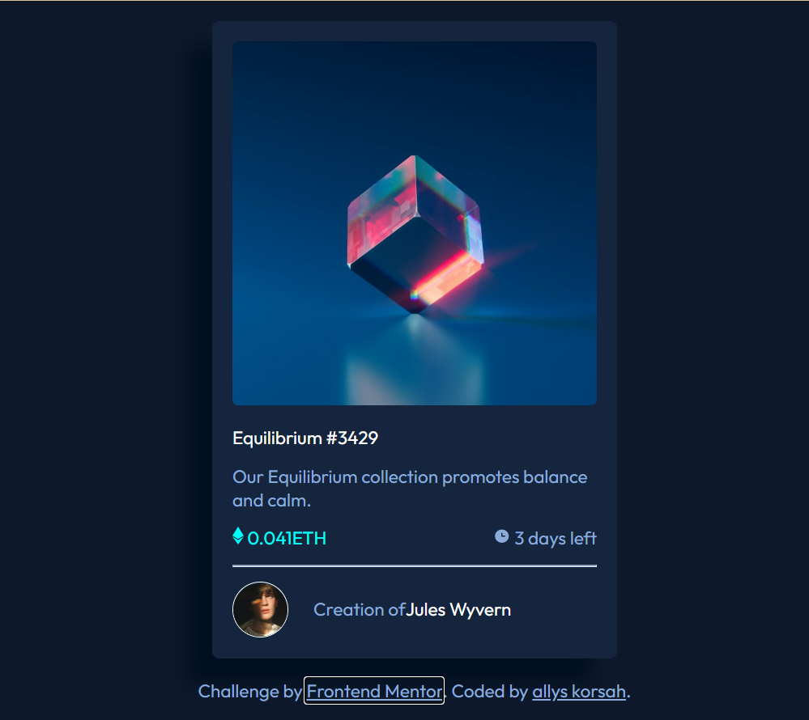

# Frontend Mentor - NFT preview card component solution

This is a solution to the [NFT preview card component challenge on Frontend Mentor](https://www.frontendmentor.io/challenges/nft-preview-card-component-SbdUL_w0U). Frontend Mentor challenges help you improve your coding skills by building realistic projects.

## Table of contents

- [Frontend Mentor - NFT preview card component solution](#frontend-mentor---nft-preview-card-component-solution)
  - [Table of contents](#table-of-contents)
  - [Overview](#overview)
    - [The challenge](#the-challenge)
    - [Screenshot](#screenshot)
    - [Links](#links)
  - [My process](#my-process)
    - [Built with](#built-with)
    - [Continued development](#continued-development)
  - [Author](#author)

## Overview

### The challenge

Users should be able to:

- View the optimal layout depending on their device's screen size
- See hover states for interactive elements

### Screenshot

### Links

- Solution URL: [frontend mentor @ allyskorsah](https://www.frontendmentor.io/solutions/nftpreviewcardcomponent-20p7pArm0Y)
- Live Site URL: [allyskorsah.github.io](https://allyskorsah.github.io/NFT-Preview-Card-Component/)

## My process

### Built with

- Semantic HTML5 markup
- CSS custom properties
- Flexbox

<h3 id="learned">What I learned</h3>

For this project I learned how to use CSS hover and overlay properties. One will notice that when the cube image is hovered it's appearance changes. That part of styling I will say was the most difficult for me, but after some research I finally put together the code which gave me that look and thus my introduction to Positioning in CSS.

### Continued development

As I mentioned in the [What I learned](#learned) section, this project introduced me to Positioning in CSS. In as much as my learning of HTML & CSS is ongoing Positioning is going to be included in my *to learn list*.

## Author

- Website - [allyskorsah.github.io](https://allyskorsah.github.io/NFT-Preview-Card-Component/)
- Frontend Mentor - [@allyskorsah](https://www.frontendmentor.io/profile/allyskorsah)
